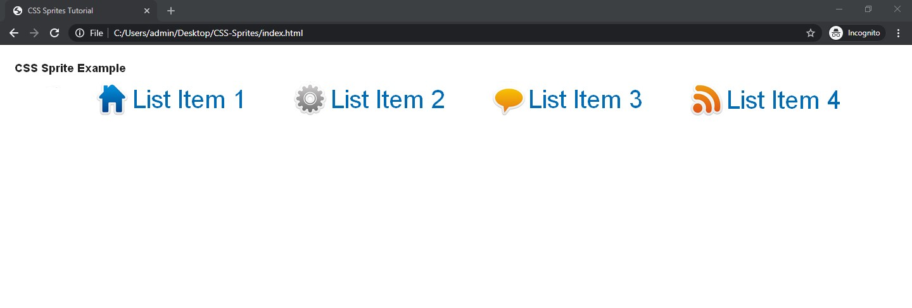

# CSS-Sprites-tutorial

This repository is created to complement my first technical article in Hackernoon.

## Built With

- HTML5
- CSS3

#### and deployed to Raw Githack

## Live Demo

[Live Demo](https://rawcdn.githack.com/tirthajyoti-ghosh/CSS-Sprites-tutorial/67b4a2a22bdec0c34ec71888da5bbf900372fea1/index.html)

## 🤝 Contributing

Contributions, issues and feature requests are welcome! Start by:

- Forking the project
- Cloning the project to your local machine
- `cd` into the project directory
- Run `git checkout -b your-branch-name`
- Make your contributions
- Push your branch up to your forked repository
- Open a Pull Request with a detailed description to the development branch of the original project for a review

## Attributions and Credit

Sprite image used from [smtusa.com](https://www.smtusa.com/blog/posts/how-to-make-css-sprite-rollover-list.html)

## Author

👤 **Tirthajyoti Ghosh**

- Github: [@tirthajyoti-ghosh](https://github.com/tirthajyoti-ghosh)
- Twitter: [@TirthajyotiGho1](https://twitter.com/TirthajyotiGho1)
- Linkedin: [tirthajyoti-ghosh](https://www.linkedin.com/in/tirthajyoti-ghosh-370544199/)

## Show your support

Give a ⭐️ if you like this project!

## 📝 License

Free

### Enjoy!
